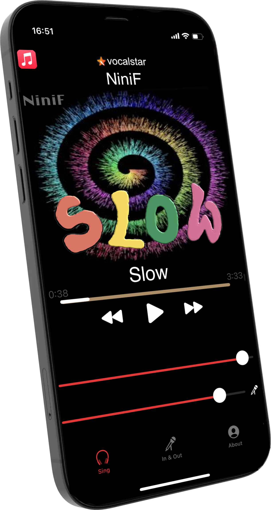

# Vocalstar
Sing along to your favorite tunes on Google Android and Apple IoS!

Works best with wired earbuds, bluetooth may cause latency, which makes your voice sound far in the distance.

Play any music with your music player app and adjust the mic volume to your liking in Vocalstar app. 

You will hear your voice crisp and clear with DSP processing like a noise gate, compression, limiter, EQ, reverb and delay, like in a recording studio. This will help you to sing in tune like a pro!

The app does not record, it is to enjoy singang along on the go.

Works on Android and IoS.

You can download your copy for free on the Apple app store and the Google play store.

This is an open source project provided to you by Tones Studio, https://tones.studio. Source code is provided on IoS in Swift/C++ and on Android in Kotlin/C++.

We are working on some exciting ML based apps and plugins, please sign up on the site to be notified.

The app has been developed by TECH41 GmbH https://tech41.de in Hamburg.

Latest release:

May 2024, IoS 1.0.8, Android 1.0.1

